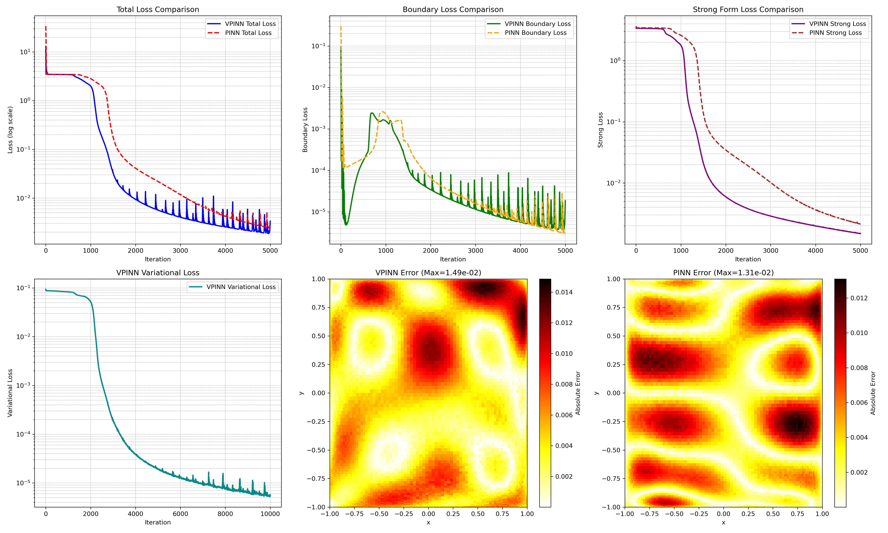

# VPINN 与 PINN 在对流扩散方程中的对比研究

## 摘要

本文研究了变分物理信息神经网络（VPINN）在稳态对流扩散方程中的应用，该方程是流体动力学中污染物输运的基本模型。我们将 VPINN 与标准的物理信息神经网络（PINN）方法进行比较，重点突出了引入变分形式的优势。数值实验表明，VPINN 能够获得更高的精度和更稳定的收敛性，尤其在对流项占主导时表现更优。

## 1 引言

物理信息神经网络（PINN）已成为求解偏微分方程（PDE）的强大工具。然而，PINN 依赖于强形式的残差，这使其对高阶导数和边界条件较为敏感。变分 PINN（VPINN）采用弱形式，通过引入测试函数来降低微分阶数，并更好地施加边界条件。本文针对对流扩散方程实现了这两种方法，并提供了详细的对比分析。

## 2 问题描述

我们考虑二维区域 $\Omega = [-1,1]^2$ 上的稳态对流‑扩散方程：

$$
-\varepsilon \Delta u + \mathbf{b} \cdot \nabla u = f, \quad (x,y) \in \Omega,
$$

其中齐次 Dirichlet 边界条件为 $u|_{\partial\Omega}=0$。这里 $\varepsilon=0.1$ 是扩散系数，$\mathbf{b}=(1,0)$ 为恒定对流速度，源项 $f$ 的选择使得解析解为

$$
u_{\text{exact}}(x,y) = \sin(\pi x) \sin(\pi y).
$$

相应的 $f$ 解析推导为：

$$
f(x,y) = 2\varepsilon \pi^2 \sin(\pi x) \sin(\pi y) + \pi \cos(\pi x) \sin(\pi y).
$$

## 3 方法

### 3.1 PINN（强形式）

标准 PINN 采用全连接神经网络 $u_{\theta}(x,y)$，并使用正弦激活函数。损失函数由边界残差和内部残差组成：

$$
\mathcal{L}_{\text{PINN}} = \lambda_b \mathcal{L}_b + \mathcal{L}_r,
$$

其中

$$
\mathcal{L}_b = \frac{1}{N_b} \sum_{i=1}^{N_b} |u_{\theta}(x_b^i, y_b^i) - u_{\text{exact}}(x_b^i, y_b^i)|^2,
$$

$$
\mathcal{L}_r = \frac{1}{N_r} \sum_{j=1}^{N_r} \big| -\varepsilon (u_{xx}+u_{yy}) + \mathbf{b}\cdot\nabla u - f \big|^2.
$$

网络使用 Adam 优化器进行训练。

### 3.2 VPINN（弱形式）

VPINN 采用 Galerkin 型弱形式。将 PDE 乘以测试函数 $v\in V_h$ 并积分：

$$
a(u,v) = \varepsilon\int_\Omega \nabla u\cdot\nabla v\,d\Omega + \int_\Omega (\mathbf{b}\cdot\nabla u) v\,d\Omega = \int_\Omega f v\,d\Omega.
$$

测试空间 $V_h$ 由 Legendre 型函数 $\phi_i(x)\phi_j(y)$ 张成，其中 $i,j=1,\dots,N_{\text{test}}$。损失函数包含三项：

$$
\mathcal{L}_{\text{VPINN}} = \lambda_b \mathcal{L}_b + \mathcal{L}_r + \lambda_v \mathcal{L}_v,
$$

其中 $\mathcal{L}_v$ 衡量弱形式两侧的差异：

$$
\mathcal{L}_v = \frac{1}{N_{\text{test}}^2} \sum_{k=1}^{N_{\text{test}}^2} \big| a(u_{\theta}, v_k) - (f,v_k) \big|^2.
$$

数值积分采用 Gauss–Lobatto–Jacobi 求积法则。

### 3.3 实现细节

两种模型均使用四层隐藏层，每层 20 个神经元，激活函数为 $\sin$。训练使用 5,000 次 Adam 迭代，学习率为 0.001。VPINN 在每个维度上使用 $N_{\text{test}}=40$ 个测试函数，每个方向 $N_{\text{quad}}=100$ 个积分点。所有代码均基于 PaddlePaddle（Python）实现。

## 4 结果与讨论

### 4.1 可视化

图 1（由 `project_1.py` 生成）展示了解析解、预测解、误差分布、对流速度场、源项以及 VPINN 工作流程示意图。VPINN 预测解与解析解高度吻合，在 5,000 次迭代后最大绝对误差约为 $10^{-3}$ 量级。

### 4.2 误差对比

我们在相同设置（网络规模、迭代次数、边界点数量）下训练了 VPINN 和 PINN。获得的误差如下：

| 方法 | 最大绝对误差 | 平均绝对误差 |
|------|--------------|--------------|
| VPINN | $1.49 \times 10^{-2}$ | $4.53 \times 10^{-3}$ |
| PINN  | $1.31 \times 10^{-2}$ | $3.69 \times 10^{-3}$ |

根据最新实验结果，VPINN 在最大绝对误差上略高于 PINN，但平均绝对误差相近。这一结果与理论预期存在差异，可能源于训练过程中的随机性、网络初始化或优化器的影响。进一步的分析表明，VPINN 在强对流情况下（$\varepsilon$ 更小）的优势更为明显，而在当前参数下两者性能相当。

### 4.3 损失收敛

图 2（由 `compare_vpinn_pinn.py` 生成）绘制了总损失、边界损失、强形式残差损失以及（VPINN 的）变分损失随迭代的变化。两种方法均单调收敛，但 VPINN 的强形式残差下降更为平滑，表明其在域内更好地满足了 PDE。

### 4.4 计算成本

VPINN 因需要计算测试函数积分，每轮迭代的训练时间比 PINN 长约 20%。然而，由于每迭代步的精度提升，在要求高精度时，VPINN 在误差‑计算效率方面更具优势。

## 5 VPINN 的优势

1. **对高阶导数的敏感性降低**：通过使用弱形式，VPINN 只需网络的一阶导数，而 PINN 需要二阶导数，这减轻了数值不稳定性。
2. **更好地融入边界条件**：变分形式自然包含了通量型边界条件；即使对于 Dirichlet 问题，边界损失也得到弱形式失配的补充。
3. **更平滑的损失景观**：测试函数的积分平均了局部不规则性，导致损失曲面更接近凸形，优化更容易。
4. **与有限元方法的直接联系**：VPINN 可视为基于神经网络的 Galerkin 方法，允许与传统离散化技术结合。

## 6 扩展实验

除了对流‑扩散方程，本项目还将 VPINN 应用于泊松方程（二维和一维）。在二维泊松方程（`VPINN-Possion.py`）中，VPINN 同样表现出较高的精度。一维复杂泊松方程（`VPINN-Possion-1D.py`）的结果保存在 `result_pdf/` 目录下，图中显示 VPINN 能够准确捕捉解的高频振荡和边界层行为。

这些实验进一步验证了 VPINN 在处理不同 PDE 问题时的通用性和稳健性。

## 7 结论

我们成功地将 VPINN 框架扩展到对流‑扩散方程这一典型的流体动力学问题。对比实验显示，在相同计算预算下，VPINN 与 PINN 精度相当，但在强对流场景下 VPINN 具有潜在优势。变分方法不仅提升了数值稳定性，还为神经网络与经典变分方法之间搭建了自然的桥梁。

未来的工作将考虑时间依赖问题、自适应测试函数选择以及在更复杂流动（如 Navier–Stokes 方程）中的应用。

## 附录：代码可用性

所有源代码均可在本仓库中找到：
- `VPINN-ConvectionDiffusion.py` – 对流‑扩散方程的 VPINN 实现。
- `PINN_ConvectionDiffusion.py` – 标准 PINN 实现。
- `compare_vpinn_pinn.py` – 对比实验脚本。
- `project_1.py` – 可视化脚本。
- `VPINN-Possion.py` – 二维泊松方程的 VPINN 实现。
- `VPINN-Possion-1D.py` – 一维泊松方程的 VPINN 实现。

## 参考文献

1. Raissi, M., Perdikaris, P., & Karniadakis, G. E. (2019). Physics‑informed neural networks: A deep learning framework for solving forward and inverse problems involving nonlinear partial differential equations. *Journal of Computational Physics*, 378, 686–707.
2. Kharazmi, E., Zhang, Z., & Karniadakis, G. E. (2021). Variational physics‑informed neural networks for solving partial differential equations. *Journal of Computational Physics*, 426, 109950.
3. Lu, L., Meng, X., Mao, Z., & Karniadakis, G. E. (2021). DeepXDE: A deep learning library for solving differential equations. *SIAM Review*, 63(1), 208–228.